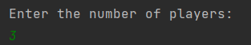
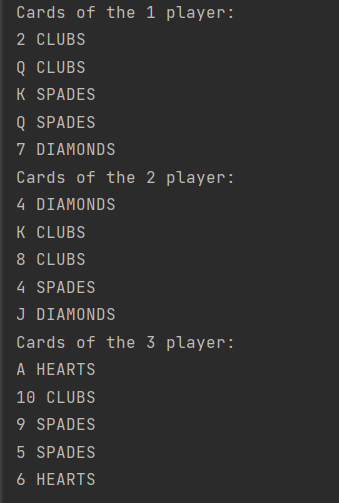

<h1 align="center">Привет 👋, меня зовут Фарид</h1>

## Poker
Напишите программу Poker.java, которая должна имитировать 
раздачу карт для игры в покер. Программа получает число n, задаваемое с 
консоли пользователем, и раздает карты на n игроков (по 5 карт каждому) из 
перетасованной колоды. Разделяйте пять карт, выданных каждому игроку, 
пустой строкой.

## Result

